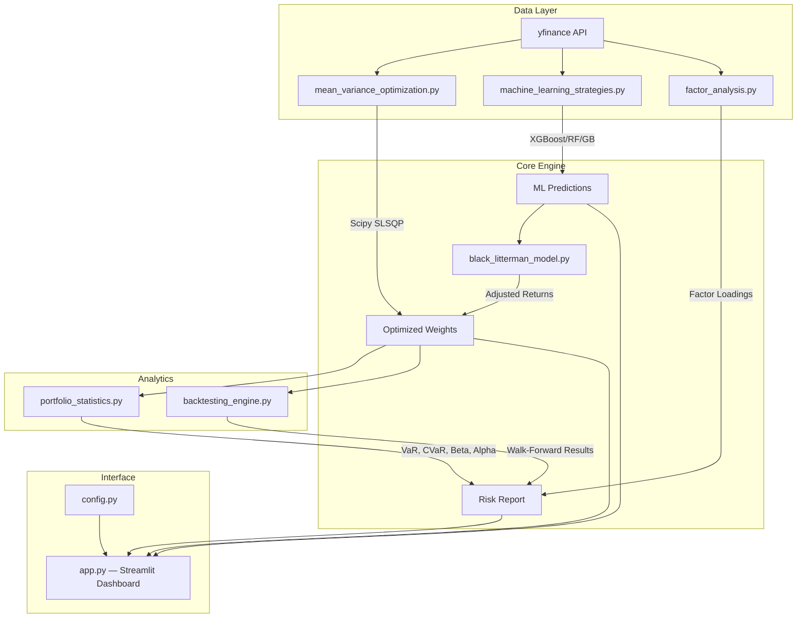

# ML Portfolio Optimization — Master's Capstone

## Project Overview
A comprehensive stock portfolio optimization system that combines classical financial theory with modern machine learning to generate optimal asset allocations and actionable trading signals. The system integrates Mean-Variance Optimization (Markowitz), the Black-Litterman Model, Fama-French Factor Analysis, and XGBoost-based forecasting into an interactive Streamlit dashboard.

## Architecture



## Features

### Core Optimization
- **Mean-Variance Optimization** — Uses `scipy.optimize.minimize` (SLSQP) for guaranteed convex-optimal portfolios, replacing Monte Carlo simulation
- **Efficient Frontier** — Computes and visualizes the full risk-return frontier with the maximum Sharpe ratio portfolio highlighted
- **Naive Benchmarks** — Equal-weight (1/N) and Risk Parity portfolios for baseline comparison

### Machine Learning
- **XGBoost, Random Forest, Gradient Boosting, Linear Regression** — Four model types with formal comparison metrics (RMSE, MAE, R²)
- **Chronological Train/Test Split** — Prevents data leakage (no random shuffling of time-series data)
- **Technical Indicators** — RSI, MACD, Bollinger Bands, momentum, volatility features
- **Hyperparameter Tuning** — `RandomizedSearchCV` with `TimeSeriesSplit` cross-validation
- **Feature Importance Analysis** — Extracted from tree-based models

### Black-Litterman Model
- Combines ML-predicted returns with market equilibrium to produce adjusted expected returns
- Dynamic market capitalization fetching via yfinance

### Risk Analytics
- **Value at Risk (VaR)** — 95% and 99% confidence historical VaR
- **Conditional VaR (CVaR)** — Expected Shortfall beyond VaR
- **Maximum Drawdown** — Peak-to-trough decline with interactive drawdown chart
- **Beta & Jensen's Alpha** — Relative to SPY market benchmark
- **Sharpe, Sortino, Information Ratios** — Full risk-adjusted performance metrics
- **Transaction Cost Analysis** — Turnover tracking and slippage cost modeling

### Factor Analysis
- **Fama-French Three-Factor Model** — Market, SMB (Size), HML (Value)
- Factor loading decomposition for each stock
- Statistical significance testing (p-values, R²)

### Trading Signals
- **Buy/Sell/Hold Recommendations** — Combining ML forecasts with 50-day moving average trends
- Signal strength classification (Strong Buy → Strong Sell)

## Interactive Dashboard (Streamlit)

Six tabs providing a comprehensive portfolio analysis interface:

| Tab | Description |
|-----|-------------|
| 📊 Rolling Backtest | Walk-forward backtest with slippage modeling |
| 📈 Efficient Frontier | Risk-return frontier with sector allocation treemap |
| 🔮 Live Forecast & Signals | Real-time ML-based Buy/Sell recommendations |
| ⚠️ Risk Dashboard | VaR, CVaR, drawdown chart, return distribution |
| 🧬 Factor Analysis | Fama-French factor loadings and alpha decomposition |
| 🤖 Model Comparison | Side-by-side ML model metrics and feature importance |

## Libraries
| Library | Purpose |
|---------|---------|
| `pandas`, `numpy` | Data manipulation and numerical computation |
| `yfinance` | Market data download |
| `scipy` | Convex portfolio optimization (SLSQP) |
| `scikit-learn` | ML models, cross-validation, metrics |
| `xgboost` | Gradient boosted tree models |
| `statsmodels` | OLS regression for factor analysis |
| `plotly` | Interactive visualizations |
| `streamlit` | Web dashboard framework |
| `matplotlib`, `seaborn` | Static charting (legacy) |
| `pytest` | Unit testing |

## Installation

```bash
git clone <repo-url>
cd ML-Portfolio-Optimization
pip install -r requirements.txt
```

## Usage

### Interactive Dashboard (Recommended)
```bash
python -m streamlit run app.py
```

### Console Script
```bash
python main.py                  # Full backtest with Plotly chart
python live_allocations.py      # Live allocation weights + trading signals
```

### Run Tests
```bash
python -m pytest tests/ -v
```

## Project Structure
```
MLPO/
├── app.py                          # Streamlit dashboard (6 tabs)
├── main.py                         # Console-based backtest script
├── live_allocations.py             # Live allocation generator
├── config.py                       # Centralized configuration
├── mean_variance_optimization.py   # Scipy SLSQP optimizer + efficient frontier
├── machine_learning_strategies.py  # ML models, features, signals
├── black_litterman_model.py        # Black-Litterman adjustment
├── portfolio_statistics.py         # Risk metrics (VaR, CVaR, Beta, etc.)
├── factor_analysis.py              # Fama-French three-factor model
├── backtesting_engine.py           # Walk-forward backtesting
├── requirements.txt
├── tests/
│   ├── test_portfolio_statistics.py
│   └── test_optimization.py
└── README.md
```

## License
This project is open-sourced under the MIT License.
