# 📈 ML-Enhanced Portfolio Optimization (MLPO)

> **A machine learning–powered portfolio optimization system that combines Mean-Variance Optimization, XGBoost predictions, and the Black-Litterman model to build smarter investment portfolios.**

**Team NH** · Arizona State University · Master's Capstone Project · 2024–2025

---

## Table of Contents

- [Overview](#overview)
- [System Architecture](#system-architecture)
- [Pipeline Flowchart](#pipeline-flowchart)
- [Project Structure](#project-structure)
- [Portfolio Universe](#portfolio-universe)
- [How It Works](#how-it-works)
  - [Mean-Variance Optimization](#1-mean-variance-optimization-mvo)
  - [Machine Learning Predictions](#2-machine-learning-predictions)
  - [Black-Litterman Blending](#3-black-litterman-blending)
  - [Backtesting](#4-backtesting)
- [Key Configuration](#key-configuration)
- [Getting Started](#getting-started)
  - [Prerequisites](#prerequisites)
  - [Installation](#installation)
  - [Running the Project](#running-the-project)
- [Dashboard Tabs](#dashboard-tabs)
- [Performance Metrics](#performance-metrics)
- [Trading Signals](#trading-signals)
- [Interpreting Results](#interpreting-results)
- [Tech Stack](#tech-stack)
- [Glossary](#glossary)

---

## Overview

MLPO answers one core question:

> *"Given a set of stocks, how much money should I put into each one to maximize gains while keeping risk under control?"*

The system builds **two competing strategies** and benchmarks them against the S&P 500 (SPY):

| Strategy | Description |
|----------|-------------|
| **MV Optimized** | Uses only mathematical optimization on historical data |
| **ML + MV Optimized** | Combines math optimization with XGBoost ML predictions via the Black-Litterman model |
| **Unoptimized** | Original dollar-weighted allocation (baseline) |
| **SPY (Market)** | The S&P 500 index benchmark |

The ML-enhanced strategy incorporates forward-looking predictions on top of the mathematical framework, aiming to outperform pure math-only optimization.

---

## System Architecture

```
┌─────────────────────────────────────────────────────────────────────┐
│                          config.py                                  │
│         Portfolio tickers, date ranges, constraints, params         │
└──────────────────────────────┬──────────────────────────────────────┘
                               │
              ┌────────────────┴────────────────┐
              ▼                                 ▼
┌──────────────────────────┐     ┌──────────────────────────────────┐
│ mean_variance_optimization│     │  machine_learning_strategies.py  │
│          .py              │     │  Feature engineering, XGBoost,   │
│  Download data, MVO,      │     │  Random Forest, trading signals  │
│  Efficient Frontier,      │     └───────────────┬────────────────┘
│  Risk Parity              │                     │
└────────────┬─────────────┘                     │
             │                                    ▼
             │                     ┌──────────────────────────────┐
             │                     │   black_litterman_model.py   │
             │                     │  Market equilibrium returns   │
             │                     │  + ML views → blended returns │
             │                     └───────────────┬──────────────┘
             │                                     │
             └──────────────┬──────────────────────┘
                            ▼
              ┌──────────────────────────┐
              │   backtesting_engine.py  │
              │  Rolling walk-forward    │
              │  backtest with slippage  │
              └────────────┬─────────────┘
                           ▼
              ┌──────────────────────────┐
              │  portfolio_statistics.py │
              │  Sharpe, Sortino, VaR,   │
              │  Beta, Alpha, Drawdown   │
              └────────────┬─────────────┘
                           ▼
              ┌──────────────────────────┐
              │    factor_analysis.py    │
              │  Fama-French 3-factor    │
              │  regression per stock    │
              └────────────┬─────────────┘
                           ▼
         ┌─────────────────┴──────────────────┐
         ▼                                    ▼
┌──────────────┐                    ┌──────────────────┐
│   main.py    │                    │     app.py       │
│  Script-based│                    │  Streamlit web   │
│  pipeline    │                    │  dashboard (6    │
│  + Plotly    │                    │  interactive     │
│  chart       │                    │  tabs)           │
└──────────────┘                    └──────────────────┘
```

---

## Pipeline Flowchart

Below is the complete 10-step pipeline that the system executes:

```mermaid
flowchart TD
    A["📋 STEP 1: Load Portfolio & Config\n<i>config.py</i>\nDefine 30 stocks, dollar amounts,\ndate ranges, constraints"] --> B

    B["📥 STEP 2: Download Historical Prices\n<i>mean_variance_optimization.py</i>\n7 years of daily closing prices\nfrom Yahoo Finance"] --> C

    C["📐 STEP 3: Standard MV Optimization\n<i>mean_variance_optimization.py</i>\nSLSQP optimizer maximizes Sharpe Ratio\nsubject to weight & volatility constraints"] --> D

    D["🔧 STEP 4: ML Feature Engineering\n<i>machine_learning_strategies.py</i>\nCreate 20+ technical indicators per stock\n(MA, RSI, MACD, Bollinger Bands, etc.)"] --> E

    E["🤖 STEP 5: Train ML Models & Predict\n<i>machine_learning_strategies.py</i>\nXGBoost predicts future prices\nusing 80/20 chronological split"] --> F

    F["🔀 STEP 6: Black-Litterman Blending\n<i>black_litterman_model.py</i>\nCombine market equilibrium returns\nwith ML predictions (τ = 0.025)"] --> G

    G["⚡ STEP 7: ML-Enhanced Optimization\n<i>mean_variance_optimization.py</i>\nRe-run SLSQP with blended\nexpected returns"] --> H

    H["📊 STEP 8: Backtest & Compare\n<i>backtesting_engine.py / main.py</i>\nApply weights to test period\nCompare all 4 strategies"] --> I

    I["🛡️ STEP 9: Risk Analysis\n<i>portfolio_statistics.py</i>\nSharpe, VaR, CVaR, Drawdown,\nBeta, Alpha, Sortino"] --> J

    J["📈 STEP 10: Display Results\n<i>app.py / main.py</i>\nCumulative returns chart, risk\ndashboards, trading signals"]

    style A fill:#2d3748,stroke:#4a90d9,color:#e2e8f0
    style E fill:#2d3748,stroke:#48bb78,color:#e2e8f0
    style F fill:#2d3748,stroke:#ed8936,color:#e2e8f0
    style J fill:#2d3748,stroke:#9f7aea,color:#e2e8f0
```



---

## Project Structure

```
MLPO/
├── config.py                        # Central settings: tickers, dates, constraints, hyperparams
├── main.py                          # Script entry point → runs full pipeline, outputs Plotly chart
├── app.py                           # Streamlit web dashboard (6 interactive tabs)
├── mean_variance_optimization.py    # MVO engine: data download, SLSQP optimizer, efficient frontier
├── machine_learning_strategies.py   # ML engine: features, XGBoost/RF/GB/LR, signals, tuning
├── black_litterman_model.py         # Black-Litterman: market caps, equilibrium returns, blending
├── portfolio_statistics.py          # Risk metrics: Sharpe, Sortino, VaR, CVaR, Beta, Alpha
├── factor_analysis.py               # Fama-French 3-factor regression per stock
├── backtesting_engine.py            # Rolling walk-forward backtest with transaction costs
├── live_allocations.py              # CLI tool for real-time weight recommendations
├── requirements.txt                 # Python dependencies
└── tests/                           # Unit tests (run with pytest)
```

### File Responsibilities

| File | Role | Key Functions |
|------|------|---------------|
| `config.py` | Central settings | `PORTFOLIO`, `SECTOR_MAP`, date ranges, constraints |
| `main.py` | Script entry point | Orchestrates the full pipeline → Plotly chart |
| `app.py` | Streamlit dashboard | 6-tab interactive UI calling all modules |
| `mean_variance_optimization.py` | MVO engine | `calculate_weights()`, `mean_variance_optimization()`, `compute_efficient_frontier()`, `risk_parity_portfolio()` |
| `machine_learning_strategies.py` | ML engine | `create_additional_features()`, `generate_investor_views()`, `compare_models()`, `generate_trading_signals()`, `tune_xgboost()` |
| `black_litterman_model.py` | BL blending | `get_market_caps()`, `get_market_returns()`, `black_litterman_adjustment()` |
| `portfolio_statistics.py` | Risk & metrics | `sharpe_ratio()`, `sortino_ratio()`, `value_at_risk()`, `conditional_var()`, `max_drawdown()`, `calculate_beta()`, `calculate_alpha()`, `full_risk_report()` |
| `factor_analysis.py` | Factor analysis | `download_factor_data()`, `analyze_factor_impact()` |
| `backtesting_engine.py` | Walk-forward backtest | `rolling_walk_forward_backtest()` |
| `live_allocations.py` | Live recommendations | Standalone CLI script for current-day allocations |

---

## Portfolio Universe

The system works with **30 US stocks** across **7 sectors** with a total starting portfolio of **~$30,000**:

| Sector | Tickers | Starting Allocation | % of Portfolio |
|--------|---------|-------------------:|:--------------:|
| **Technology** | AAPL, MSFT, GOOGL, NVDA, ADBE, CRM | $7,600 | ~25.3% |
| **Healthcare** | JNJ, UNH, PFE, ABBV, LLY | $5,600 | ~18.7% |
| **Finance** | JPM, BAC, GS, MS, BLK | $5,300 | ~17.7% |
| **Consumer Goods** | PG, KO, WMT, COST, NKE | $4,600 | ~15.3% |
| **Industrial** | CAT, BA, HON | $2,600 | ~8.7% |
| **Energy** | XOM, CVX, COP | $2,200 | ~7.3% |
| **Utilities** | NEE, DUK, SO | $2,100 | ~7.0% |

---

## How It Works

### 1. Mean-Variance Optimization (MVO)

Invented by Harry Markowitz (Nobel Prize, 1952), MVO finds the portfolio weights that maximize return for a given level of risk. The system uses the **SLSQP** (Sequential Least Squares Programming) optimizer to maximize the **Sharpe Ratio** while enforcing constraints:

- Each stock weight: between **1%** and **25%**
- All weights sum to **100%**
- Total portfolio volatility ≤ **22.5%**

The optimizer computes the **covariance matrix** (how all 30 stocks move relative to each other) and iteratively adjusts weights until it finds the mathematically optimal allocation.

### 2. Machine Learning Predictions

The ML pipeline runs for each of the 30 stocks individually:

**Feature Engineering** — 20+ technical indicators are computed from raw price data:

- Moving Averages (5, 10, 20, 50-day)
- RSI (Relative Strength Index)
- MACD + Signal Line + Histogram
- Bollinger Bands (Upper, Lower, Width, Position)
- Momentum (5, 10, 20-day)
- Volatility (10, 20-day rolling)
- Lagged prices (1–5 days back)

**Models Available:**

| Model | Type | Description |
|-------|------|-------------|
| **XGBoost** (primary) | Sequential boosting | Builds 100 decision trees, each correcting the last |
| **Random Forest** | Parallel ensemble | 100 independent trees averaged together |
| **Gradient Boosting** | Sequential boosting | Parent algorithm of XGBoost (slower, for comparison) |
| **Linear Regression** | Baseline | Simple straight-line fit as a sanity check |

**Training discipline** — Strict chronological 80/20 split (no data leakage). The model never sees future data during training.

### 3. Black-Litterman Blending

The Black-Litterman model (Goldman Sachs, 1990) solves a key flaw in pure MVO: extreme sensitivity to expected return estimates. It works in three steps:

1. **Market Equilibrium Returns** — Derive what the market "expects" each stock to return based on real market-cap data and the S&P 500 index return.
2. **ML Views** — XGBoost's predicted return for each stock, weighted by its R² confidence score.
3. **Blending** — The BL formula combines equilibrium returns and ML views, giving more weight to high-confidence predictions. Parameter **τ = 0.025** controls trust in market equilibrium.

The blended expected returns then feed back into the SLSQP optimizer to produce ML-enhanced portfolio weights.

### 4. Backtesting

**Static Backtest** (`main.py`) — Train once on 2013–2020, apply fixed weights to 2020–2025, compare all 4 strategies day by day.

**Rolling Walk-Forward Backtest** (`backtesting_engine.py`) — The more realistic approach:

```
For each quarter in the backtest period:
  1. Train on the most recent 36 months of data
  2. Run MVO + ML + Black-Litterman pipeline
  3. Rebalance portfolio weights
  4. Deduct transaction costs (0.1% slippage × turnover)
  5. Simulate daily returns for the next 3 months
  6. Slide the window forward and repeat
```

This mimics how a real fund manager would operate — always retraining on recent data and accounting for trading costs.

---

## Key Configuration

All settings are centralized in `config.py`:

| Parameter | Value | Description |
|-----------|-------|-------------|
| Risk-Free Rate | 4% | Baseline safe return (US government bonds) |
| Max Volatility | 22.5% | Portfolio risk ceiling |
| Min Weight / Stock | 1% | No stock is completely excluded |
| Max Weight / Stock | 25% | No single-stock concentration |
| Training Period | Nov 2013 – Nov 2020 | 7 years of historical learning data |
| Backtest Period | Nov 2020 – Nov 2025 | 5 years of out-of-sample testing |
| XGBoost Estimators | 100 | Number of sequential trees |
| XGBoost Learning Rate | 0.1 | Step size for error correction |
| XGBoost Max Depth | 3 | Tree complexity limit |
| BL Tau (τ) | 0.025 | Uncertainty about market equilibrium |
| Rolling Window | 36 months | Retraining lookback period |
| Rebalance Frequency | 3 months | Quarterly weight updates |
| Slippage | 0.1% | Transaction cost per rebalance |

---

## Getting Started

### Prerequisites

- **Python 3.8+**
- **pip** (Python package manager)
- Internet connection (for Yahoo Finance data downloads)

### Installation

```bash
# 1. Clone the repository
git clone https://github.com/your-username/MLPO.git
cd MLPO

# 2. (Optional) Create a virtual environment
python -m venv venv
source venv/bin/activate        # macOS / Linux
venv\Scripts\activate           # Windows

# 3. Install dependencies
pip install -r requirements.txt
```

### Running the Project

There are three ways to use the system:

#### Option A — Static Analysis (Script)

```bash
python main.py
```

Runs the full pipeline end-to-end and opens an interactive Plotly chart comparing all 4 strategies over the backtest period.

#### Option B — Interactive Web Dashboard

```bash
streamlit run app.py
```

Opens a 6-tab web dashboard at `http://localhost:8501` with configurable parameters and interactive visualizations.

#### Option C — Live Allocation Recommendations

```bash
python live_allocations.py
```

Downloads the most recent 5 years of market data, runs the full ML+BL+MVO pipeline, and prints current recommended weights and trading signals for all 30 stocks.

#### Running Tests

```bash
cd tests/
pytest
```

---

## Dashboard Tabs

When running `streamlit run app.py`, you get 6 tabs:

| Tab | Name | What You Can Do |
|-----|------|-----------------|
| 1 | **Rolling Backtest** | Configure training window, slippage, and volatility cap. Run the walk-forward backtest and view cumulative return chart for all strategies. |
| 2 | **Efficient Frontier** | Compute and visualize the frontier curve. See the max-Sharpe optimal point and sector allocation treemap. |
| 3 | **Live Forecast & Signals** | Select ML model and tickers. Generate real-time Buy/Sell/Hold signals with color-coded output. |
| 4 | **Risk Dashboard** | Full risk report: Sharpe, Sortino, Beta, Alpha, VaR, CVaR, Max Drawdown. Interactive drawdown chart and return distribution histogram. |
| 5 | **Factor Analysis** | Fama-French 3-factor regression for all stocks. Factor loading bar charts and alpha visualization. |
| 6 | **Model Comparison** | Pick any stock and compare all 4 ML models head-to-head (RMSE, MAE, R²). View feature importance rankings. Optional XGBoost hyperparameter tuning. |

---

## Performance Metrics

The system evaluates strategies using these financial metrics:

| Metric | What It Measures | Good Range |
|--------|-----------------|:----------:|
| **Sharpe Ratio** | Return earned per unit of risk | > 1.0 |
| **Sortino Ratio** | Return per unit of *downside* risk only | > 1.0 |
| **Information Ratio** | Consistency of outperformance vs SPY | > 0.3 |
| **VaR (95%)** | Worst daily loss at 95% confidence | Lower is better |
| **CVaR (Expected Shortfall)** | Average loss on the worst 5% of days | Lower is better |
| **Max Drawdown** | Largest peak-to-trough decline | < 20% |
| **Beta** | Sensitivity to market movements | 0.7 – 1.1 |
| **Alpha (Jensen's)** | Return above what market risk explains | > 0% |

### Benchmark Scale

| Metric | Poor | Acceptable | Good | Excellent |
|--------|:----:|:----------:|:----:|:---------:|
| Sharpe | < 0 | 0 – 0.5 | 0.5 – 1.5 | > 1.5 |
| Sortino | < 0 | 0 – 0.8 | 0.8 – 2.0 | > 2.0 |
| Info Ratio | < 0 | 0 – 0.3 | 0.3 – 0.7 | > 0.7 |
| Max Drawdown | > 40% | 20 – 40% | 10 – 20% | < 10% |
| ML R² | < 0 | 0 – 0.3 | 0.3 – 0.7 | > 0.7 |

---

## Trading Signals

The system generates **Buy/Sell/Hold signals** by combining two independent inputs:

| Trend (50-day MA) | ML Predicted Return | Signal |
|:------------------:|:-------------------:|:------:|
| ↑ Upward | > +1% | 🟢 **Strong Buy** |
| ↑ Upward | > +0.5% | 🟢 **Buy** |
| ↑ Upward | < −0.5% | 🔴 **Sell** |
| ↓ Downward | < −1% | 🔴 **Strong Sell** |
| ↓ Downward | < −0.5% | 🔴 **Sell** |
| ↓ Downward | > +0.5% | ⚪ **Hold** |
| Either | Neutral | ⚪ **Hold** |

---

## Interpreting Results

### Cumulative Returns Chart

The main output is a line chart with 4 strategies over the backtest period:

- **Blue — ML + MV Optimized** → Should be the highest line (the "smart" strategy)
- **Red — MV Optimized Only** → Should beat the baseline, validating mathematical optimization
- **Green — SPY (Market)** → The benchmark both strategies aim to beat
- **Purple — Unoptimized** → The baseline; should be lowest if optimization works

### What "Winning" Means

A strategy **wins** if it achieves a **higher Sharpe Ratio** than SPY **and** a higher final return, while staying within the volatility constraint. The ML+MV strategy is expected to win because it layers forward-looking ML predictions on top of the mathematical framework.

---

## Tech Stack

| Category | Tools |
|----------|-------|
| **Language** | Python 3.8+ |
| **Data** | Yahoo Finance (`yfinance`) |
| **ML** | XGBoost, scikit-learn (Random Forest, Gradient Boosting, Linear Regression) |
| **Optimization** | SciPy (`scipy.optimize.minimize` with SLSQP) |
| **Statistics** | NumPy, Pandas, statsmodels (OLS regression) |
| **Visualization** | Plotly (interactive charts), Streamlit (web dashboard) |
| **Backtesting** | Custom rolling walk-forward engine |

---

## Glossary

| Term | Definition |
|------|-----------|
| **Alpha (α)** | Portfolio return above what market risk (beta) explains |
| **Beta (β)** | How much the portfolio moves relative to the overall market |
| **Black-Litterman** | Model blending market consensus with investor views (ML predictions) |
| **Covariance Matrix** | Table showing how every pair of stocks moves together |
| **CVaR** | Average loss on the worst X% of days (Expected Shortfall) |
| **Efficient Frontier** | Curve of optimal portfolios offering highest return per risk level |
| **Fama-French** | 3-factor model decomposing returns into Market, Size, and Value factors |
| **MACD** | Moving Average Convergence Divergence — momentum indicator |
| **MVO** | Mean-Variance Optimization — finding optimal risk/return balance |
| **R²** | How much variance the model explains (0 = none, 1 = perfect) |
| **RSI** | Relative Strength Index — overbought/oversold gauge (0–100) |
| **Sharpe Ratio** | Return earned per unit of total risk |
| **SLSQP** | Sequential Least Squares Programming — the optimization algorithm |
| **Sortino Ratio** | Like Sharpe but only penalizes downside risk |
| **SPY** | S&P 500 ETF — the market benchmark |
| **Tau (τ)** | Black-Litterman parameter for market equilibrium uncertainty |
| **VaR** | Value at Risk — worst expected loss at a given confidence level |
| **XGBoost** | Extreme Gradient Boosting — the primary ML model |

---

<p align="center"><b>Team NH</b> · ML Portfolio Optimization · Arizona State University · 2024–2025</p>
